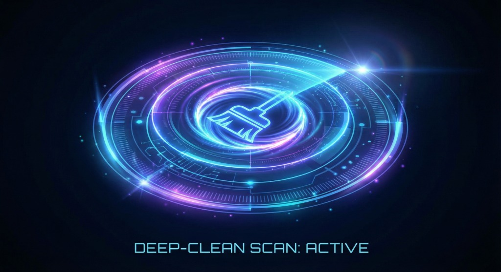

# 🌐 WEDO Link CleanSuite

A next-generation macOS Cleaning, Optimization & Auto-Maintenance Suite.

<p align="center">
  
</p>


<p align="center">
  <b>Smart. Automated. Safe. Perfectly Designed for macOS.</b><br>
  Complete system cleaning, storage recovery, mail optimization, browser cleanup, LINE space reclaim, and scheduled maintenance — all automated.
</p>


<p align="center">
  
  
  
  
</p>


---

## ✨ Features

### 🔹 Smart Automated Cleaning

| 功能 | 描述 |
| :--- | :--- |
| **Quick Clean（快速清理）** | 清除系統快取、暫存、垃圾桶、App 快取 |
| **Deep Clean（深度清理）** | 清除 Mail Attachments、Notion/Eagle/瀏覽器/重型快取 |
| **每天自動清理一次** | 定時 04:00 自動快速清理 |
| **每週深度清理** | 每週日凌晨進行 Deep Clean |
| **磁碟剩餘 < 20GB 自動清理** | 系統自動監控並清理 |
| **開機自動清理** | macOS Login 時自動執行 Quick Clean |


---

### 🔹 App-Specific Cleanup Modules

| 清理類型 | 對應清理項目 |
| :--- | :--- |
| **Apple Mail Attachments** | `~/Library/Mail` / `Mail Downloads` |
| **Safari 清理** | Safari Cache / Local Storage |
| **Chrome 清理** | Default Cache / Temp |
| **LINE 清理** | LINE macOS 儲存空間與緩存 |
| **Notion / Eagle** | 重型 App 資料清理 |


---

### 🔹 Menubar Integration

CleanSuite 會安裝在選單列：
*   🧹 立即快速清理
*   🔄 啟用/停用每日清理
*   🌙 啟用/停用每週深度清理
*   📉 啟用/停用磁碟 <20GB 自動清理
*   🚀 啟動主 App
*   ❌ 離開

支援 macOS Light / Dark Mode 自動切換。

---

### 🔹 Auto-Update（自動更新）

CleanSuite 具備：
*   背景檢查 GitHub Releases
*   自動下載更新（pkg）至 `/tmp/cleansuite-update.pkg`
*   推送 macOS Notification
*   版本差異提醒

使用者永遠保持最新版本。

---

## 🧩 Installation

### 📦 方式一：直接安裝（推薦）

👉 **點擊下載最新版本：**
[https://github.com/你的帳號/WedoLinkCleanSuite/releases/latest](https://github.com/你的帳號/WedoLinkCleanSuite/releases/latest)

下載 `.pkg` → 雙擊安裝 → 完成。

---

### 🛠 方式二：自行 Build

1. **Clone 專案**

```bash
git clone https://github.com/你的帳號/WedoLinkCleanSuite.git
cd WedoLinkCleanSuite
```

2. **編譯主程式**

```bash
./scripts/build.sh
```

3. **打包成 pkg**

```bash
./scripts/package.sh
```


---

## 📁 Project Structure

```
WedoLinkCleanSuite/
│
├── src/
│   ├── core/            # 主程式架構
│   ├── cleaners/        # 各模組清理器
│   ├── menubar/         # 選單列 App
│   ├── scheduler/       # 自動排程
│   └── utils/           # 公用工具
│
├── assets/
│   ├── icons/           # App icons / menu icons
│   └── ui/              # UI 素材
│
├── scripts/
│   ├── build.sh
│   ├── package.sh
│   ├── cleanup.sh
│   ├── scheduler-setup.sh
│   └── notarize.sh
│
├── pkg/                 # 產生的 .pkg 安裝檔
└── README.md
```


---

## ⚙️ Core Cleaning Logic

### Quick Clean

```bash
rm -rf ~/Library/Caches/*
rm -rf /Library/Caches/*
rm -rf ~/.Trash/*
rm -rf ~/Library/Application\ Support/Google/Chrome/Default/Cache/*
rm -rf ~/Library/Application\ Support/Microsoft/Edge/Default/Cache/*
rm -rf ~/Library/Caches/com.apple.Safari/*
```

### Apple Mail Cleanup

```bash
rm -rf ~/Library/Mail/V*/Attachments/*
rm -rf ~/Library/Containers/com.apple.mail/Data/Library/Mail\ Downloads/*
```


---

## 📡 Auto-Update

CleanSuite 會自動檢查：

`https://github.com/你的帳號/WedoLinkCleanSuite/releases/latest`

若版本不同：
*   自動下載
*   發通知
*   提示安裝新版本

---

## 🖥 Roadmap

| 版本 | 功能 |
| :--- | :--- |
| **1.1** | UI Dashboard、Storage Analyzer |
| **1.2** | SpotLight & RAM Optimization |
| **1.3** | Duplicate Files Scanner |
| **2.0** | WEDO 雲端同步設定 |


---

## 💙 Credits

**WEDO International Marketing Group**
Cleansuite powered by Antigravity + AI Automation.

---

## 📩 Feedback

如果你想新增功能或改善體驗，歡迎建立 Issue：

👉 [https://github.com/hjuming/WedoLinkCleanSuite/issues](https://github.com/hjuming/WedoLinkCleanSuite/issues)

---
